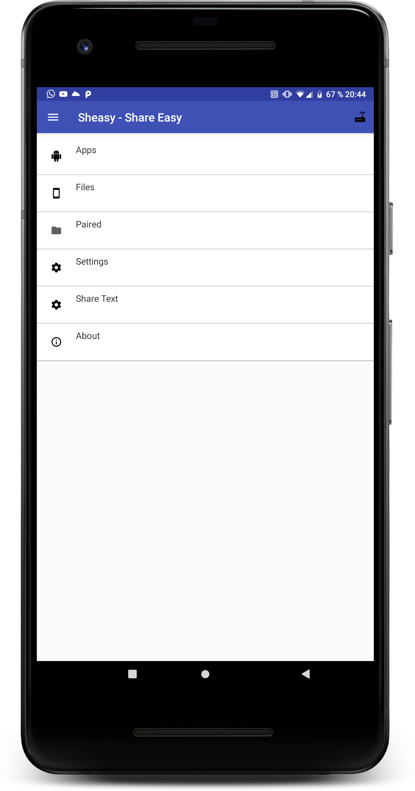
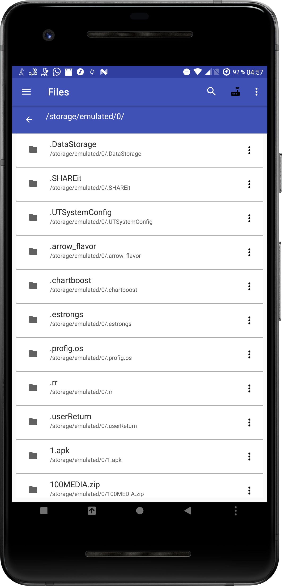
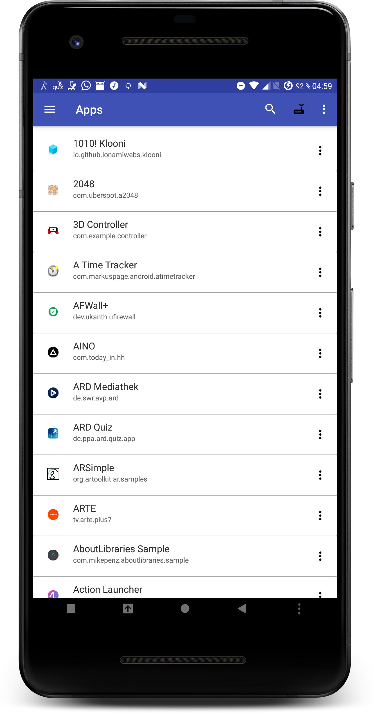

<h1 align="center">Sheasy - Share Easy </h1>

  

> This an Android App that helps you share/manage your files on your Android Device through a WebInterface in the Browser

<a href="#introduction">Introduction</a> &bull; <a href="#-features">Features</a> &bull; <a href="##-roadmap">Roadmap</a> &bull; <a href="#-architecture">Architecture</a> &bull; <a href="#-feedback">Feedback</a>&bull; <a href="#-docs">Docs</a> &bull; <a href="##-contributors">Contributors</a>

## Introduction

  

The goal is to write an open source app that makes it super easy to share files from one device to another

It's a hobby project i started to learn about Kotlin, React(Kotlin-JS) and Ktor. 

## 🎨 Features
A few of the things you can do with Sheasy:
- <a href="https://github.com/Foso/Sheasy/wiki/Download-Apks">download apks</a>

- <a href="https://github.com/Foso/Sheasy/wiki/Download-Files">download files</a>

- <a href="https://github.com/Foso/Sheasy/wiki/Upload-Files">upload files</a>

## 🗺️ Roadmap
- [ ] HTTPS
- [ ] receive notifications in browser
- [ ] see log of last transactions

# 🏠 Architecture

## Project Structure
* <kbd>app</kbd> - Base android project directory that contains the app
* <kbd>desktop</kbd> - A Kotlin Jvm project with the desktop server
* <kbd>web</kbd> - The web client. This module is using the Kotlin Multiplatform Plugin, but is only configured to compile to Javascript/React.
The main entry of the module is inside the <kbd>index.kt</kbd>.

* <kbd>serverJvm</kbd> - Shared module for <kbd>app</kbd> and <kbd>desktop</kbd>, which contains server specific classes/interfaces

* <kbd>libshared</kbd> - Shared module for <kbd>app, desktop and web</kbd>, which contains specific classes/interfaces like Error types or responses

## 🛠️ Built With
### Kotlin

The App is completely written in Kotlin (except the used JVM/JS libraries)

### Android

### Backend
* [Ktor](https://github.com/ktorio/ktor) - Used as Backend

### Frontend
* [Kotlin React](https://kotlinlang.org/docs/tutorials/javascript/kotlin-to-javascript/kotlin-to-javascript.html) - Used for Web Frontend

## Getting Started

Please take a look at the instructions in the [Wiki](https://github.com/Foso/Sheasy/wiki). 

## 📙 Docs
Please take a look into the [Wiki](https://github.com/Foso/Sheasy/wiki) 

## 💬 Contributors 

This project follows the [all-contributors](https://github.com/kentcdodds/all-contributors) specification and is brought to you by these [contributors](./CONTRIBUTORS.md).

## ✍️ Feedback

Feel free to send feedback on [Twitter](https://twitter.com/jklingenberg_) or [file an issue](https://github.com/foso/sheasy/issues/new). Feature requests are always welcome. If you wish to contribute, please take a quick look at the [guidelines](./CONTRIBUTING.md)!

Screenshots
-----------

## 📜 License

This project is licensed under the Apache License, Version 2.0 - see the [LICENSE.md](https://github.com/Foso/Sheasy/blob/master/LICENSE) file for details

### Find this project useful ? :heart:
* Support it by clicking the :star: button on the upper right of this page. :v:

License
-------

    Copyright 2018 Jens Klingenberg

    Licensed under the Apache License, Version 2.0 (the "License");
    you may not use this file except in compliance with the License.
    You may obtain a copy of the License at

       http://www.apache.org/licenses/LICENSE-2.0

    Unless required by applicable law or agreed to in writing, software
    distributed under the License is distributed on an "AS IS" BASIS,
    WITHOUT WARRANTIES OR CONDITIONS OF ANY KIND, either express or implied.
    See the License for the specific language governing permissions and
    limitations under the License.

